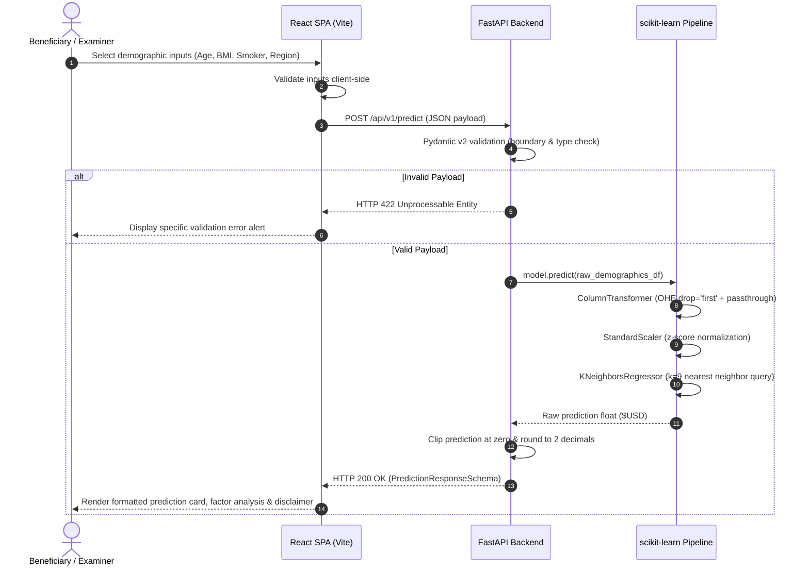

# System Architecture & Technical Specifications

## 1. Architectural Overview

The **Medical Insurance Cost Prediction** system is structured as a decoupled full-stack machine learning web application featuring:
- **Client Tier:** A single-page application (SPA) developed with **React**, **Vite**, and **Tailwind CSS**.
- **Application & Serving Tier:** An asynchronous RESTful API powered by **FastAPI** and **Pydantic v2**.
- **Model Execution Tier:** A serialized **scikit-learn Pipeline** combining a `ColumnTransformer` (OneHotEncoder + StandardScaler) and a distance-weighted `KNeighborsRegressor`.
- **Governance & Integrity Tier:** Structured training metadata (`model_metadata.json`) containing cross-validation metrics, hyperparameter search grids, and held-out error analyses.

```
+-------------------------------------------------------------------------+
|                              USER BROWSER                               |
|                  React 19 + Tailwind CSS Web Application                |
+------------------------------------+------------------------------------+
                                     |
                          HTTP / REST (JSON)
                                     v
+------------------------------------+------------------------------------+
|                         FASTAPI BACKEND API                             |
|                        (Port 8000 / ASGI)                               |
|                                                                         |
|   +-----------------------------------------------------------------+   |
|   |                  Pydantic v2 Input Validation                   |   |
|   |    (Age 18-100, BMI 10-65, Children 0-10, Strict Categories)     |   |
|   +--------------------------------+--------------------------------+   |
|                                    | (In-Memory Validated DataFrame)    |
|                                    v                                    |
|   +-----------------------------------------------------------------+   |
|   |               Unified scikit-learn Pipeline                     |   |
|   |  - ColumnTransformer: passthrough numerics + OneHotEncoder      |   |
|   |  - StandardScaler: zero mean, unit variance scaling             |   |
|   |  - KNeighborsRegressor (k=9, Minkowski distance p=2)            |   |
|   +--------------------------------+--------------------------------+   |
|                                    | (Predicted Dollar Estimate)        |
|                                    v                                    |
|   +-----------------------------------------------------------------+   |
|   |                     REST Response Formatter                     |   |
|   |         {"prediction": 3314.86, "model": "KNN", ...}            |   |
|   +-----------------------------------------------------------------+   |
+------------------------------------+------------------------------------+
                                     |
                       Zero Storage / In-Memory Only
                                     v
                       (No database persistence)
```

---

## 2. Component Hierarchy & File Structure

```text
ml_pro1-v2/
├── frontend/                     # React Single-Page Application
│   ├── src/
│   │   ├── components/           # Modular presentation components
│   │   │   ├── Navbar.jsx        # Top navigation & system status
│   │   │   ├── Hero.jsx          # Problem statement & primary CTA
│   │   │   ├── PredictionForm.jsx# Beneficiary profile & presets
│   │   │   ├── PredictionResult.jsx # Formatted cost & disclaimer
│   │   │   ├── ModelComparison.jsx  # Dynamic benchmark comparisons
│   │   │   ├── ErrorAnalysis.jsx # Subgroup residual breakdown
│   │   │   ├── Methodology.jsx   # Training workflow & viva Q&A
│   │   │   └── Footer.jsx        # Privacy policy & attributions
│   │   ├── services/
│   │   │   └── api.js            # Fetch wrapper with error handling
│   │   ├── App.jsx               # Root layout & state coordinator
│   │   ├── index.css             # Tailwind v4 import & custom styles
│   │   └── main.jsx              # React entry point
│   ├── vite.config.js            # Vite bundler & reverse proxy config
│   ├── package.json              # Frontend dependencies
│   └── README.md
│
├── backend/                      # FastAPI Python Application
│   ├── app/
│   │   ├── main.py               # FastAPI factory & lifespan loader
│   │   ├── api/
│   │   │   └── routes.py         # /health, /predict, /metadata, /insights
│   │   ├── schemas/
│   │   │   └── prediction.py     # Pydantic v2 schemas
│   │   ├── services/
│   │   │   └── prediction_service.py # In-memory model execution
│   │   └── core/
│   │       └── config.py         # Application settings & CORS
│   ├── models/
│   │   ├── model.pkl             # Persisted scikit-learn Pipeline
│   │   └── model_metadata.json   # Full empirical evaluation audit
│   ├── requirements.txt          # Backend dependencies
│   └── README.md
│
├── data/
│   └── insurance.csv             # 1,338 benchmark patient records
│
├── notebooks/
│   └── Medical_Insurance_Cost_Prediction_Third_Year_FINAL.ipynb # Research
│
├── tests/
│   ├── test_api.py               # FastAPI test client suite
│   ├── test_ml.py                # Pipeline structure & inference tests
│   └── test_validation.py        # Boundary & schema rejection tests
│
├── docs/
│   ├── PROJECT_AUDIT.md          # Complete pre-transformation audit
│   ├── ARCHITECTURE.md           # System design & data flow
│   ├── API_DOCUMENTATION.md      # OpenAPI specification
│   ├── ML_METHODOLOGY.md         # Scientific report & viva Q&A
│   ├── TESTING.md                # Automated test execution report
│   └── DEPLOYMENT.md             # Production setup instructions
│
├── train_and_save_model.py       # Reproducible ML training script
├── pytest.ini                    # Pytest configuration
├── requirements.txt              # Unified dependencies
└── README.md                     # Master project documentation
```

---

## 3. End-to-End Prediction Sequence



---

## 4. Privacy & Data Governance Architecture

1. **Zero Database Retention:** No relational (PostgreSQL/MySQL) or document (MongoDB) databases exist in the system.
2. **In-Memory Request Processing:** All input features are held in RAM solely for the duration of the HTTP request cycle and deallocated immediately by Python's garbage collector.
3. **No File Persistence:** Neither user demographic inputs nor prediction results are written to CSV files, disk logs, or external cloud analytics.
4. **Sanitized Server Logging:** FastAPI logs operational events (such as application startup and endpoint latency) without dumping raw request bodies into server logs.
